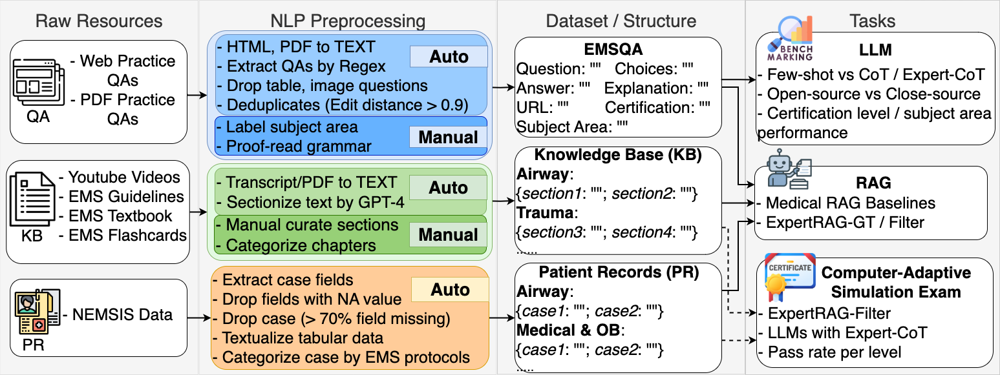

## Expert-Guided Prompting and Retrieval-Augmented Generation for EMS Question Answering

Code repository: **Expert-Guided Prompting and Retrieval-Augmented Generation for EMS Question Answering**, AAAI 2026

<p align="center">
  🌐 <a href="https://xueren-ge.github.io/Expert-Guided-Prompting-and-Retrieval-Augmented-Generation-for-EMS-Question-Answering/">Project</a>
  · 📄 <a href="">Paper</a>
  · 🤗 <a href="https://huggingface.co/datasets/Xueren/EMS-MCQA">Dataset</a>
</p>

### Overall Stucture of the Work

1. We introduce **EMSQA**, the first EMS MCQA dataset of 24.3K questions, curated based on public and private sources, covering 10 subject areas and 4 certification levels, and accompanied by a structured, subject area-aligned **EMS knowledge base** (KB) with 40K documents and 4M real-world patient care reports. Partial data (from public sources) and the whole EMS KB will be shared as a resource with the EMS and research communities.
2. We propose two approaches to inject domain expertise into LLMs: 1) an **expertise-guided prompting strategy (Expert-CoT)** that encourages step-by-step reasoning from a domain-specific perspective. 2) **an expertise-guided RAG method (ExpertRAG)** that selectively retrieves expertise-aligned knowledge from curated EMS KBs and patient records
3. We benchmark multiple LLMs on EMSQA, evaluating performance across certification levels and subject areas, and compare our framework against SOTA RAG methods. Experimental results show that combining Expert-CoT and ExpertRAG yields up to a 4.67% improvement in accuracy. Notably, the **32B expertise-augmented models pass all the EMS certification simulation exams**.

### Data, Knowledge Base and Patient Records
#### Dataset
Download from Huggingface [EMS-MCQA](https://huggingface.co/datasets/Xueren/EMS-MCQA)

#### Knowledge base
Download from Huggingface [EMS-Knowledge](https://huggingface.co/datasets/Xueren/EMS-Knowledge). We also upload the embedding encoded by MedCPT to [link](https://drive.google.com/drive/folders/1a7BC6okBMoqS4j6zY5vECn-X-7xUzdnN?usp=drive_link), where you can download and directly load using FAISS.

#### Patient Records
Apply at [NEMSIS](https://nemsis.org/using-ems-data/request-research-data/) to request the patient records, and use our scripts to process the data. Or you can download the embedding encoded by MedCPT from [link](https://drive.google.com/drive/folders/1_362lCph863LXtrR-vNHuT8nQhTSzdmQ?usp=sharing), and directly load using FAISS.

### Expert-CoT and Expert-RAG

#### Filter (Left)
To guide the LLM reasoning and RAG retrieval based on question-specific expertise, we train a lightweight LLM-based filter to predict the key expertise attributes, including
question’s subject area and certification level. 
#### Expert-CoT (Mid)
Expert-CoT prompting guides the model’s reasoning by explicitly providing the subject area and certification level as starting point for the thought process.
#### Expert-RAG (Right)
The filter’s predicted subject area guides the retriever to search for relevant knowledge base entries and patient records tailored to the question’s subject area. The LLM then conditions on the predicted expertise and the retrieved documents to generate the final answer. 

**Global**: Retrieve the top M and N evidence documents from the entire KB and PR, respectively. 

**Filter then Retrieve (FTR)**: First filter the whole KB and PR to retain only documents matching the predicted subject area, then retrieve the top M and N documents from these filtered subsets

**Retrieve then Filter (RTF)**: First retrieve a larger candidate set from the whole KB and PR (e.g., 10 × Mfrom KB and 10 × N from PR), then filter out documents whose subject area do not match ˆsi, retaining the top M and N relevant documents

### How to run the code

#### Run Benchmarks 
Go benchmark folder
```
cd code/benchmark
```
We used Qwen/Qwen3-32B as an example to show how to run our code, you can specify other models like "meta-llama"

* zero-shot prompting
    ```bash
    python benchmark_LLM.py 
        --model_name_or_path=Qwen/Qwen3-32B \
        --mode=infer \
        --prompt=zeroshot 
    ```
* cot prompting
    ```bash
    python benchmark_LLM.py 
        --model_name_or_path=Qwen/Qwen3-32B \
        --mode=infer
        --prompt=cot
        --enable_think=True
    ```

* expert-cot prompting
    ```bash
    python benchmark_LLM.py 
        --model_name_or_path=Qwen/Qwen3-32B \
        --mode=infer
        --prompt=cot_attr
        --enable_think=True
    ```


#### Run Expert-RAG
Go EMSRAG folder
```
cd code/EMSRAG
```

We used Qwen/Qwen3-32B as an example to show how to run our code, you can specify other models like "meta-llama"
*  Expert-RAG-Filter: 
    
    Retrieval mode: **Retrieve then Filter (RTF)**
    
    ```bash
    python ems_rag.py 
        --model_name_or_path=Qwen/Qwen3-32B \
        --mode=infer \
        --prompt=cot_attr \
        --use_kb=True \
        --kb_k=32 \
        --use_pr=True \
        --pr_k=8 \
        --filter_mode=retrieve_then_filter \
        --use_adapter=True \
        --enable_think=True
    ```

    Retrieval mode: **Filter then Retrieve (FTR)**
    
    ```bash
    python ems_rag.py 
        --model_name_or_path=Qwen/Qwen3-32B \
        --mode=infer \
        --prompt=cot_attr \
        --use_kb=True \
        --kb_k=32 \
        --use_pr=True \
        --pr_k=8 \
        --filter_mode=filter_then_retrieve \
        --use_adapter=True \
        --enable_think=True
    ```

    Retrieval mode: **Global**
    
    ```bash
    python ems_rag.py 
        --model_name_or_path=Qwen/Qwen3-32B \
        --mode=infer \
        --prompt=cot_attr \
        --use_kb=True \
        --kb_k=32 \
        --use_pr=True \
        --pr_k=8 \
        --filter_mode=global \
        --use_adapter=True \
        --enable_think=True
    ```

There are some other specifications you can set to run the experiments,
* **Ground-truth expertise label**: use_adapter=False
* **Use only KB as retrieval documents**: --use_kb=True --kb_k=32 --use_pr=False --pr_k=0
* **Use only PR as retrieval documents**: --use_kb=False --kb_k=0 --use_pr=True --pr_k=8
* **Different prompting**: --prompt=cot/zero-shot
* **Run evaluation to get accuracy and f1-score**: mode=eval


### Code to crawl EMS-MCQA and KB
Go to these folders to check how to do crawling

**EMS-MCQA (close source)**
1. app-emtprep-com
2. jblearning-com

**EMS-MCQA (open source)**
1. careeremployer-com
2. emt-for-dummy
3. EMTBasicExam5thEditionpdf
4. learningexpresshub-com
5. miningquiz-com
6. mometrix-com
7. montgomerycountymd-gov
8. mycprcertificationonline-com
9. nremtpracticetestcom
10. pocketprep-com
11. practicetestgeeks-com
12. Quizizz-com
13. quizlet-com
14. smartmedic-com
15. uniontestprepcom

**EMS-Knowledge**
1. app-emtprep-com
2. emra-org
3. ems-pharmacology-reference-guide
4. emt-for-dummy
5. firearmstraininglosangelesca-com
6. jblearning
7. mediprofirstaid-com
8. ODEMSA
9. onlinelibrary-wiley-com
10. paramedic-medication-manual
11. redcross-org
12. youtube
